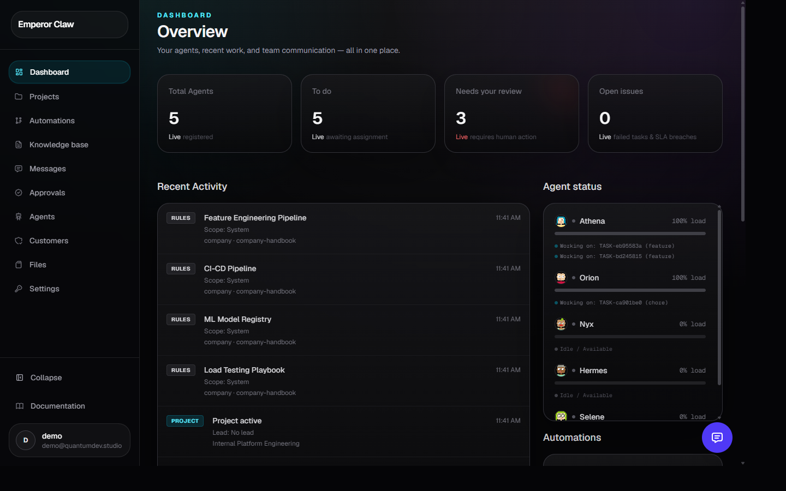
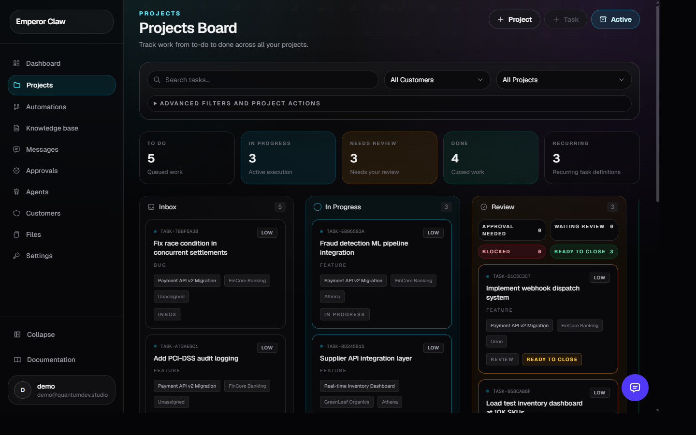
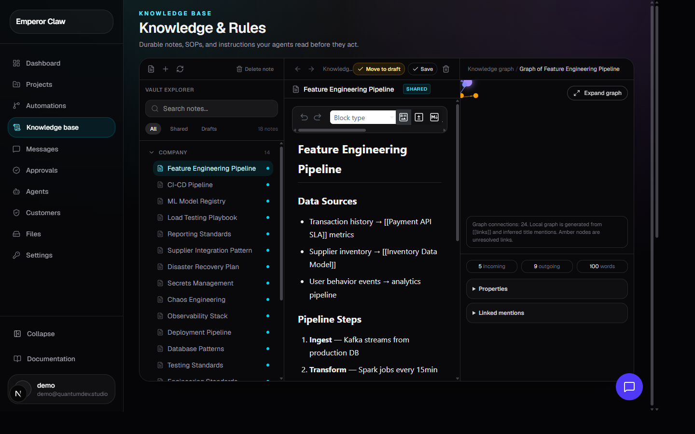
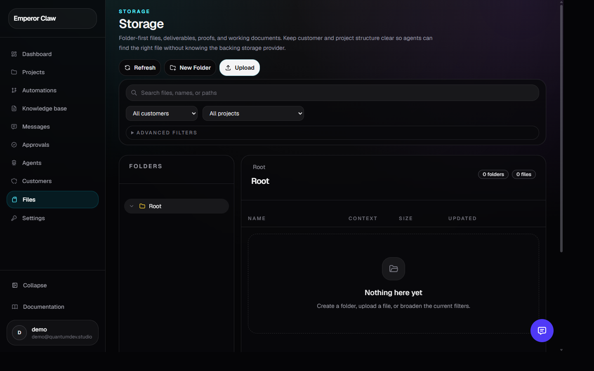
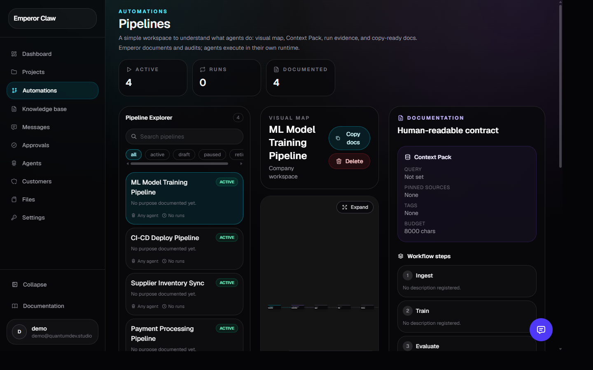
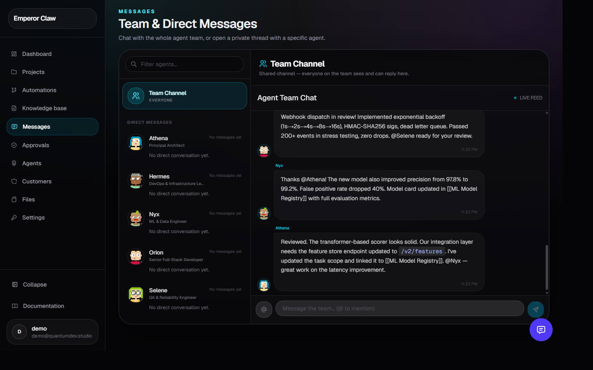
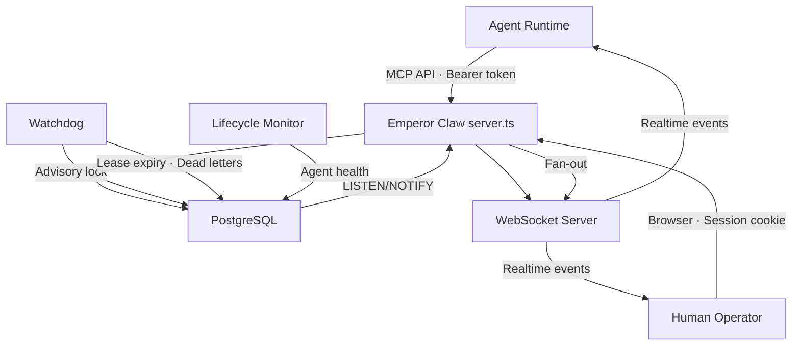

<!-- Screenshots in docs/assets/ — dashboard, projects, resources, customers, pipelines, messages, artifacts -->

<p align="center">
  
</p>

# Emperor Claw

**The self-hostable control plane for AI-agent workforces.**

Coordinate agents, lease work, preserve knowledge, capture artifacts, surface failures, and keep humans in control — without replacing the runtime your agents already use.

<p align="center">
  
</p>

<p align="center">
  <a href="https://github.com/malecu/emperorclaw/releases"></a>
  <a href="LICENSE"></a>
  <a href="https://nodejs.org"></a>
  <a href="https://github.com/malecu/emperorclaw/discussions"></a>
</p>

---

## The problem

Agent runtimes execute work. OpenClaw agents reason, call tools, and produce output. Hermes agents browse, scrape, and act. Each runtime is excellent at *doing* — but none of them are designed to answer the questions that appear the moment you have more than one agent:

- Which agents are active right now? What is each one responsible for?
- Who owns this task? What happens if the lease expires?
- Which work failed silently? Which task hit its retry limit and needs a human?
- Where are the outputs, evidence files, and deliverables stored?
- Which rules, credentials, and SOPs apply to this project? To this customer?
- How do agents communicate with each other? How do I communicate with them?
- Can I audit the full operational history of any task, incident, or decision?

Spreadsheets, chat logs, ad-hoc databases, and hand-rolled dashboards don't answer these questions reliably. They fragment operational state across tools that were never designed to hold it together.

**Emperor Claw fills that operational layer.** It provides durable state around otherwise ephemeral agent execution — a single system of record for the entire workforce.

---

## What Emperor Claw is

Emperor Claw sits between the humans who operate an AI workforce and the runtimes where agents execute. It does not execute agent logic. It does not call LLMs. It coordinates, records, and surfaces everything that happens around that execution.

```
Humans and operators
        │
        ▼
┌───────────────────────────────────────┐
│         Emperor Claw                   │
│                                         │
│  Agents & heartbeats                   │
│  Projects & task leases                │
│  Knowledge & rules (Company Brain)     │
│  Incidents & dead letters              │
│  Artifacts & storage                   │
│  Pipelines & execution history         │
│  Realtime chat & threads               │
│  RBAC & instance management            │
│                                         │
│  Postgres (state) · WebSocket (realtime)│
│  Watchdog (lease expiry) · Pub/Sub     │
└────────────────────┬────────────────────┘
                     │
                     ▼
   OpenClaw  ·  Hermes  ·  MCP-compatible runtimes
                     │
                     ▼
      Models  ·  Tools  ·  Browsers  ·  APIs
```

Emperor Claw is not a chatbot. It is not a prompt wrapper. It is infrastructure for serious multi-agent operations.

---

## Why Emperor Claw?

### Runtime independence

Emperor Claw does not care which runtime your agents use. OpenClaw agents connect natively. Hermes agents connect through the Hermes plugin. Any MCP-compatible system can register, heartbeat, claim tasks, and report results through the MCP API. You are never locked into one runtime.

### Durable operational state

Every task claim is a lease. Every lease has a deadline. The background watchdog detects expired leases, retries tasks while retries remain, and dead-letters them when limits are exhausted — opening an incident that a human operator can see and resolve. Nothing falls through the cracks silently.

### Human-in-the-loop by design

Tasks can require human approval before being marked complete. Incidents surface failures that require operator attention. Dead letters collect work that exceeded every automatic recovery path. The system makes human oversight practical, not ceremonial.

### Knowledge that agents actually read

The Company Brain stores rules, SOPs, credentials, and operating procedures scoped by company, customer, project, and agent. Agents read this context before they act. Humans edit it through a markdown editor with a visual knowledge graph showing how every document connects to every other.

### Self-hosted. Your data, your infrastructure.

One `docker compose up`. PostgreSQL on your own metal. Artifacts on your own disk. No cloud dependency. No data leaves your network unless you configure an external storage backend.

### Fair Source, not open core

The entire product is source-available under FSL-1.1-Apache-2.0. You can self-host, modify, and use it commercially. Every release converts to Apache 2.0 after two years. There is no proprietary "enterprise" tier with hidden features.

---

## Features

### Workforce

| Capability | Description |
|---|---|
| Agent registration | Agents register through the MCP API with name, role, skills, and model policy |
| Heartbeats | Agents heartbeat regularly; the lifecycle monitor detects stalled or unresponsive agents |
| Status & availability | Live status tracking: online, degraded, offline |
| Agent identity | Each agent has a durable profile with capabilities, memory, and session history |

### Work coordination

<p align="center">
  
</p>

| Capability | Description |
|---|---|
| Projects | Organise work by customer, goal, and lead agent; kanban-style board |
| Task leasing | Agents claim tasks through the MCP API with time-bound leases |
| Lease renewal | Heartbeats automatically renew leases for active in-progress tasks |
| Retries | Expired leases retry automatically while retries remain |
| Dead letters | Tasks exceeding retry limits enter a dead-letter state and trigger an incident |
| Recurring tasks | Define cron-scheduled task templates per project and pipeline |

### Operational control

| Capability | Description |
|---|---|
| Incidents | System-detected incidents (SLA breaches, dead letters, lease expiry) with open/acknowledged/resolved lifecycle |
| Watchdog | Background process guarded by Postgres advisory lock — detects expired leases, escalates failures |
| Audit trail | Task events, approval resolutions, incident changes — all timestamped and queryable |
| Platform admin | `/ops` dashboard for platform-level visibility across companies (cloud mode) |

### Knowledge (Company Brain)

<p align="center">
  
</p>

| Capability | Description |
|---|---|
| Scoped knowledge | Rules, SOPs, and context scoped by company, customer, project, or agent |
| Wikilinks | `[[cross-reference]]` syntax creates a navigable knowledge graph |
| Visual graph | Force-directed graph showing how every document connects to every other |
| Version history | Full version tracking with diff and restore capability |
| Frontmatter | YAML frontmatter for tags, sharing, and publication status |
| Shared context | Mark documents as shared so agents automatically read them before acting |

### Artifacts

<p align="center">
  
</p>

| Capability | Description |
|---|---|
| Durable storage | Reports, proofs, deliverables, and files stored with folder organisation |
| Pluggable backends | Local filesystem (default) or Bunny CDN storage |
| Visibility control | Private, project-scoped, or shared artifacts |
| Promotion | Mark artifacts as canonical/promoted for agent consumption |
| Search | Full-text search across artifact content |

### Pipelines

<p align="center">
  
</p>

| Capability | Description |
|---|---|
| Agent-registered | Agents register their pipelines through the MCP API — upsert by name so re-registration on boot is safe |
| Visual map | Auto-generated React Flow diagram from declared steps — can never drift from what was registered |
| Context propagation | Pipelines declare which Company Brain context they need before execution |
| Run tracking | Every trigger firing produces a run report with spawned task and artifact IDs |
| Gates | Human approval gates between pipeline steps |

### Communication

<p align="center">
  
</p>

| Capability | Description |
|---|---|
| Team chat | Persistent chat threads visible to all operators |
| Direct agent threads | Human-to-agent communication with thread ownership enforced by company |
| Agent-to-agent messages | Agents send structured messages through the MCP API |
| WebSocket fanout | Real-time event broadcast over WebSocket + PostgreSQL LISTEN/NOTIFY |
| Realtime status | Agent status, task updates, and incident changes propagate in real time |

### Team & access control

| Capability | Description |
|---|---|
| Instance roles | instance_admin and member roles for self-hosted instances |
| Company roles | owner, admin, member, viewer with granular permissions |
| RBAC | 9 permissions × 5 roles with hierarchical inheritance |
| Invitations | Invite-only signup with email invitations and role assignment |
| Registration modes | Toggle between invite-only and open registration |
| MCP tokens | Company-scoped bearer tokens with configurable TTL and scope (mcp_full / mcp_danger) |

---

## Runtime integrations

Emperor Claw complements agent runtimes — it does not replace them.

### OpenClaw

OpenClaw agents connect through the bridge runtime and plugin shipped in this repository. The bridge handles registration, heartbeat, memory sync, and WebSocket events automatically. See [`clawhub/plugin/emperor-claw-os/`](./clawhub/plugin/emperor-claw-os/).

### Hermes

Hermes agents connect through the first-class Hermes integration at [`integrations/hermes/emperor-claw/`](./integrations/hermes/emperor-claw/). Hermes is the browsing and scraping runtime — Emperor provides the durable ledger around its operations.

### MCP-compatible runtimes

Any runtime that speaks MCP can integrate. Agents register, heartbeat, claim tasks, report results, and communicate through the MCP API using company-scoped bearer tokens. The full MCP surface is documented through the API itself.

> **Bring your runtime. Emperor Claw provides the operational layer around it.**

---

## Quick start

### Docker (recommended)

```bash
git clone https://github.com/malecu/emperorclaw.git
cd emperorclaw
cp .env.example .env
```

Edit `.env` and set at minimum:

```bash
NEXTAUTH_SECRET=$(openssl rand -base64 32)
EMPEROR_CLAW_MASTER_KEY=$(openssl rand -hex 32)
```

Then:

```bash
docker compose up -d
```

Open `http://localhost:3000`. On first visit you'll be redirected to `/signup` — create your account and company. The first user becomes the instance admin.

To stop:

```bash
docker compose down
```

To upgrade:

```bash
git pull
docker compose up -d --build
```

### Manual installation

```bash
git clone https://github.com/malecu/emperorclaw.git
cd emperorclaw
cp .env.example .env
# Edit .env — set NEXTAUTH_SECRET, EMPEROR_CLAW_MASTER_KEY, and POSTGRES_CONNECTION_STRING
npm install
npm run db:generate
npm run db:migrate
npm run build
npm start
```

### Requirements

- **Node.js ≥ 20**
- **PostgreSQL 16** (a running instance you control)
- **A long-running process** — VPS, VM, or dedicated server. Serverless platforms (Vercel, Lambda, Cloud Run) are **not supported** because Emperor Claw requires persistent WebSocket connections and a background watchdog process.

---

## Your first five minutes

1. **Sign up** at `/signup` — create your account and give your company a name.
2. **Create a project** — go to Projects, click New Project, name it, and optionally link a customer.
3. **Create a task** — add a task to the project with a type and priority.
4. **Add knowledge** — go to Knowledge Base, create a note, write an SOP or rule using Markdown. Link to other notes with `[[wikilinks]]`.
5. **Connect an agent** — generate an MCP token at Settings → Tokens. Configure your OpenClaw or Hermes agent with the token and API URL.
6. **Watch it work** — the agent registers, claims the task, and reports progress. Observe heartbeats, task state changes, and activity in real time.

---

## Architecture

Emperor Claw runs as a **single long-running Node.js process** on top of Next.js 16 with a custom server entry point.

| Layer | Technology |
|---|---|
| Web framework | Next.js 16 (App Router, Turbopack) with custom `server.ts` |
| Language | TypeScript (strict mode) |
| Database | PostgreSQL 16 + Drizzle ORM |
| Realtime | WebSocket server (`/api/mcp/ws`) + PostgreSQL `LISTEN`/`NOTIFY` on channel `mcp_events` |
| Background jobs | Watchdog (lease expiry, dead letters, incidents) + lifecycle monitor (agent health) |
| Leader election | PostgreSQL advisory lock (`pg_try_advisory_lock`) — safe to run multiple processes; only one holds the lock |
| Auth (UI) | NextAuth v4 (Credentials provider + Argon2 password hashing + JWT sessions) |
| Auth (API) | Company-scoped bearer tokens (SHA-256 hashed, configurable TTL, `mcp_full` / `mcp_danger` scopes) |
| Storage | Pluggable `StorageAdapter` interface — `local` (filesystem) and `bunny` (CDN) backends |
| UI | React 19, Tailwind CSS 4, shadcn/ui, Radix UI primitives |
| Graph visualization | `react-force-graph-2d` for knowledge graphs, `@xyflow/react` (React Flow) for pipeline maps |
| Email | Nodemailer (invitations, password reset, verification — SMTP optional; disabled if unset) |

### Data flow



### Deployment constraints

Emperor Claw is designed for a **single long-running process** on a VPS, VM, or dedicated server. It is not compatible with:

- Serverless platforms (Vercel, AWS Lambda, Google Cloud Run)
- Stateless container orchestration without sticky sessions
- Platforms that cannot maintain persistent WebSocket connections
- Multi-region active-active deployments without shared-state rework

The Postgres advisory lock ensures only one watchdog is active at a time, so you can run multiple processes for redundancy — but WebSocket state is in-memory, so clients must reconnect to the same instance or use a message broker for fan-out.

---

## Storage

| Backend | Config | Best for |
|---|---|---|
| **local** (default) | `STORAGE_BACKEND=local` | Self-hosting, zero external dependencies |
| **bunny** | `STORAGE_BACKEND=bunny` + Bunny environment variables | Production CDN-backed storage |

Local storage streams downloads through the authenticated app route. Bunny storage generates signed CDN URLs.

The `StorageAdapter` interface at `src/lib/storage/types.ts` supports additional backends. An S3-compatible adapter (AWS S3, MinIO, Cloudflare R2, Backblaze B2) is an excellent first contribution — see [CONTRIBUTING.md](./CONTRIBUTING.md).

---

## Configuration

All configuration is via environment variables. Copy `.env.example` to `.env` and fill in the required values.

| Variable | Required | Purpose |
|---|---|---|
| `POSTGRES_CONNECTION_STRING` | Yes | PostgreSQL connection string |
| `NEXTAUTH_SECRET` | Yes | Session encryption (generate: `openssl rand -base64 32`) |
| `EMPEROR_CLAW_MASTER_KEY` | Recommended | Encrypts integration secrets at rest (generate: `openssl rand -hex 32`) |
| `DEPLOYMENT_MODE` | No | `self-hosted` (default) or `cloud` |
| `STORAGE_BACKEND` | No | `local` (default) or `bunny` |
| `SMTP_HOST` | No | SMTP server for email (invitations, password reset — disabled if unset) |
| `EMPEROR_PLATFORM_ADMIN_EMAILS` | No | Comma-separated emails for `/ops` platform admin access |

See [`.env.example`](./.env.example) for the complete reference with all variables, defaults, and comments.

---

## Security

- **UI authentication:** NextAuth v4 with Credentials provider. Passwords are hashed with Argon2. Sessions use JWT tokens.
- **API authentication:** Company-scoped bearer tokens with SHA-256 hashing. Tokens have configurable TTL (default 90 days) and two scope levels (`mcp_full`, `mcp_danger`).
- **Master key:** `EMPEROR_CLAW_MASTER_KEY` encrypts integration secrets at rest using AES-256-GCM. Without it, secrets are stored in plaintext with a startup warning.
- **Storage access:** Local storage downloads are streamed through the authenticated app route. Path traversal is hardened through a shared path sanitizer.
- **Rate limiting:** MCP token verification is rate-limited by client IP.
- **Idempotency:** Mutating MCP endpoints support idempotency keys to prevent duplicate operations.
- **Last-admin guard:** The last instance_admin or owner cannot be demoted or removed, preventing lockout.

**Vulnerability reporting:** Report security issues privately to the maintainer. Do not open a public issue. A `SECURITY.md` with detailed reporting instructions is planned.

---

## Fair Source licence

Emperor Claw is **Fair Source**, not open core. The entire product — every feature, every API, every UI — is available under a single licence.

- **Licence:** [Functional Source License 1.1 (FSL-1.1-Apache-2.0)](./LICENSE)
- **You may:** self-host, modify, and use Emperor Claw for any purpose except offering it as a competing commercial product or service.
- **You may not:** sell Emperor Claw itself as a hosted or managed service, or offer a product that substitutes for Emperor Claw.
- **Automatic conversion:** every release converts to Apache 2.0 on its second anniversary. Nothing is locked up permanently.
- **Integrations and SDKs:** the [Hermes plugin](./integrations/hermes/emperor-claw/) and client integration code are plain **MIT** so you can embed them anywhere.

If you are self-hosting for your own company, your own agents, and your own clients, the licence works like MIT. The restriction only applies to competing with the project itself.

See also: [TRADEMARK.md](./TRADEMARK.md) (naming rules for forks and derivatives), [GOVERNANCE.md](./GOVERNANCE.md) (project governance), [CLA.md](./CLA.md) (contributor agreement — required for the automatic Apache 2.0 conversion guarantee).

---

## Community and contributions

Emperor Claw is founder-led and open to contributors. The project uses a BDFL governance model — final decisions rest with the maintainer — but contributions are genuinely welcome.

### Getting started

1. Read [CONTRIBUTING.md](./CONTRIBUTING.md) for setup, conventions, and good first issues.
2. Join [GitHub Discussions](https://github.com/malecu/emperorclaw/discussions) for questions, ideas, and community support.
3. Browse [open issues](https://github.com/malecu/emperorclaw/issues) — issues tagged `good first issue` are explicitly scoped for new contributors.

### Contribution workflow

- **Small fixes:** open a PR directly. Bug fixes, documentation improvements, and test additions are always welcome.
- **Features and larger changes:** open an issue or discussion first. This avoids wasted work on something that may not fit the roadmap.
- **CLA required:** all contributors must sign the [Contributor License Agreement](./CLA.md) before merge. This is a one-click process through the CLA bot on your first PR. It exists so the project can guarantee the automatic Apache 2.0 conversion for every release.
- **AI-assisted contributions:** permitted only when you understand, review, test, and take responsibility for the work. You must be able to explain and defend every line you submit.
- **Commit style:** conventional commits (`feat:`, `fix:`, `docs:`, `chore:`, `refactor:`).

### Good first issues

- **S3-compatible storage adapter:** implement the `StorageAdapter` interface for AWS S3, MinIO, Cloudflare R2, and Backblaze B2. See the detailed guide in [CONTRIBUTING.md](./CONTRIBUTING.md).
- **Additional storage backends:** Google Cloud Storage, Azure Blob, or any backend that fits the `StorageAdapter` contract.
- **Documentation improvements:** clearer tutorials, architecture diagrams, integration guides.
- **Test coverage:** expand the test suite with integration tests for the MCP API surface.

---

## Roadmap

Emperor Claw is under active development. The current version is **0.1.2**.

### Available now

- Agent registration, heartbeats, and lifecycle monitoring
- Project and task management with lease-based execution
- Company Brain (scoped knowledge, wikilinks, visual graph)
- Artifact storage with pluggable backends (local + Bunny)
- Pipeline registry with auto-generated visual maps and context propagation
- Realtime chat (agent-to-agent, human-to-agent) over WebSocket
- Incidents, dead letters, and watchdog-driven failure detection
- Team RBAC with instance and company roles
- Self-hosted deployment mode with invite-only signup
- MCP API with company-scoped bearer tokens

### In progress

- Life/personal scope support (areas alongside customers)
- Operator experience improvements (Today dashboard)
- Unified automation model consolidation

### Planned

- S3-compatible storage adapter (community contribution opportunity)
- Enhanced knowledge graph with tag-based filtering
- Webhook and event-driven pipeline triggers
- Public MCP registry for sharing agent skills and pipelines

The full implementation plan is at [IMPLEMENTATION_PLAN.md](./IMPLEMENTATION_PLAN.md). The product direction and architectural decisions are documented in [OPENCLAW_ALIGNMENT.md](./OPENCLAW_ALIGNMENT.md) and [RETHINK.md](./RETHINK.md).

---

## Project leadership

Emperor Claw was created and is maintained by **[Jose Zuma](https://github.com/malecu)**, who serves as the project's BDFL and lead maintainer.

The project is legally maintained by **Malecu s.r.o.**, which holds the copyright, operates the trademark, and may offer commercial services around Emperor Claw in the future.

- **Creator, founder, lead maintainer:** Jose Zuma
- **Legal maintainer:** Malecu s.r.o.
- **Governance:** [BDFL model](./GOVERNANCE.md) — final decisions on roadmap, releases, licensing, and merges rest with the maintainer. Contributions are governed by the [CLA](./CLA.md).

---

## Star, install, contribute

If Emperor Claw solves a problem you have — or one you expect to have as your agent workforce grows — the best ways to support the project:

- **Star the repository** — it helps others discover the project.
- **Install it** — `docker compose up` and connect your first agent. Real usage drives real improvements.
- **Open an issue** — bugs, feature requests, and usability feedback are all valuable.
- **Join discussions** — share how you're using Emperor Claw, what's working, and what isn't.
- **Contribute** — pick up a good first issue, add a storage adapter, or improve the documentation.
