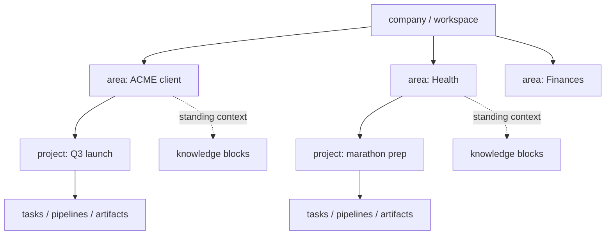
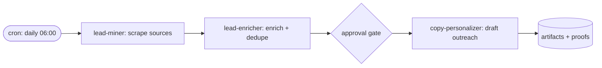

# RETHINK: Emperor Claw as a Work + Life Agent OS

Date: 2026-06-10
Status: Proposal for review (no code changed)

## The goal, restated

You should be able to wake up, open Emperor, and see: *today I'm working on Project Y, agent A is already handling X, pipeline P ran overnight and produced Z, and my "life" agent has two things waiting for me.* Same agents, different context per scope. Recurring pipelines are registered, self-documented, and visualized.

The current system is already strong as a **control plane** (tasks, leases, incidents, approvals, audit). What it's missing is the **operator experience** (a daily driver), a **single honest automation model** (today there are five), **life as a first-class scope**, and a **knowledge base that composes per scope** instead of being a flat credential store.

---

## 1. What other agent-OS systems do (and what to steal)

**Letta (MemGPT)** — memory as composable *blocks*, not text fields. Core memory blocks are small, capped, agent-editable, and crucially **shareable: attach one block to many agents and they all see updates immediately**. This is exactly your "same agent, different context per project" requirement — context is an attachment, not a clone. Steal: block-based knowledge entries with explicit attach/share semantics.

**OpenClaw Lobster** — deterministic pipelines: sequential steps, JSON between steps, approval gates, resume tokens. Steal: your pipeline registry should *reference* runtime workflows, not reimplement them. Emperor registers, documents, and tracks runs; OpenClaw executes. This matches your existing doctrine ("Emperor is the system of record, OpenClaw is the executor").

**Mission Control dashboards (OpenClaw ecosystem)** — the winning pattern is one "operations surface for the day": boards, human-in-the-loop gates, decision trails. Steal: a single **Today** page as the default landing surface.

**Notion Custom Agents** — agents get a *job* plus a *trigger or schedule* and run unattended. Steal: the mental model "pipeline = job + trigger + owner agent + visible history."

**PARA (personal knowledge management)** — Projects / Areas / Resources / Archive. The key insight for the life side: a *Project* ends, an *Area* (health, finances, family, home) never ends — it has a standard to maintain. Steal: Areas as the life-side sibling of Customers.

What none of them have (your edge): durable multi-tenant state with lease-based tasks, proofs, approvals, and incidents. Don't dilute that. Make it operable.

---

## 2. The scope model: add `areas`, generalize ownership

### Today

```
company → customer? → project → tasks/memory/artifacts
```

Everything is implicitly "work for a client." Life doesn't fit: "Health" is not a customer, and "renew passport" doesn't belong to a customer project.

### Proposed



**Add: `areas` table** — `{ id, companyId, name, kind: 'customer' | 'life' | 'internal', notes, standingGoal, defaultAgentId, createdAt, deletedAt }`.

**Edit: `customers` becomes `areas` with `kind='customer'`.** Migration is mechanical (rename + add column). Every place that scopes to `customerId` (projects, artifacts, artifactFolders, schedules, scopedResources via scopeType) gets `areaId` instead. The UI label can stay "Customers" inside a work-focused company and "Areas" generally.

**Edit: `projects`** — add `name` (today a project only has `goal`, which makes "I'm working on Project Y" awkward — a goal is a sentence, a name is a handle). Add `areaId`. Keep `goal` as the outcome statement.

Why one mechanism instead of a separate "life mode": every feature you already built — tasks, proofs, approvals, memory, pipelines — works identically for "ACME outreach" and "tax season." Two scope trees would double every query and page. One `kind` column does it.

**Per-scope agent context already exists and is the right shape:** `projectAgentProfiles` (displayName, memorySeed, resourcePolicyJson per agent×project) is precisely "same agent, different hat." Extend it with an optional `areaId` so an agent can also have a standing profile per area (your "live project" agent), not only per project.

---

## 3. Knowledge base: from credential store to composable blocks

### Today

`scopedResources` is doing three jobs at once: secrets/credentials (SMTP, API keys), durable context ("Knowledge & Rules" prose in `configText`), and templates/identities. Meanwhile agent memory is scattered across four places (`agents.memory` text column, `agentMemorySnapshots`, `agentMemoryEntries`, `projectMemory`) with no sharing semantics.

### Proposed

**Add: `knowledgeBlocks`** — the Letta-style primitive:

| column | purpose |
|---|---|
| `scopeType` / `scopeId` | company, area, project, or agent |
| `kind` | `rule`, `context`, `identity`, `template`, `sop` |
| `title`, `content` | the block itself (markdown), size-capped |
| `pinned` | pinned blocks are always injected into context leases for that scope |
| `updatedByType/Id` | agents may edit blocks they're attached to (audit via existing auditLog) |

**Add: `knowledgeBlockAttachments`** — `{ blockId, agentId | projectId }`. Attachment, not copy. When the block changes, every attached agent sees it on next lease. This is the mechanism that lets "the same agent with different context" be cheap: the agent is one row; its context is the set of blocks resolved for (agent, project, area).

**Edit: `scopedResources` shrinks to what it's good at** — credentials and integrations (it already has secretText, lease logging, failure tracking). Prose moves to knowledgeBlocks. The lease endpoint composes both: secrets from scopedResources + pinned blocks from knowledgeBlocks, resolved by scope chain (agent → project → area → company), nearest scope wins on conflict.

**Edit: memory consolidation** — keep `agentMemoryEntries` (it's the most general: kind, scope links, metadata) and `projectMemory`. Deprecate `agents.memory` (a single mutable text blob with no history) and fold `agentMemorySnapshots` into `agentMemoryEntries` with `kind='snapshot'`. Three memory stores → two, with a clear split: *memory entries* are what agents learned (append-only, agent-written); *knowledge blocks* are what you curated (editable, human-or-agent-written, shareable).

---

## 4. Pipelines: one model, self-documenting, visualized

### Today — five overlapping concepts

| concept | state |
|---|---|
| `workflowTemplates` | contractJson, barely used |
| `playbooks` | instructionsJson, UI says "Legacy Surface" |
| `schedules` | cron → playbook, UI says "Legacy Surface" |
| `tactics` | proposed/approved steps, separate page |
| `recurringTaskDefinitions` | cron → spawns real tasks; the only one wired into the real task engine |

This is the single biggest cleanup opportunity. Only `recurringTaskDefinitions` participates in the lease/proof/incident machinery that makes Emperor honest.

### Proposed

**Add: `pipelines`** — the registry entry (the thing you asked for):

| column | purpose |
|---|---|
| `companyId`, `areaId?`, `projectId?` | where it lives |
| `name`, `purpose` | human handle + one-sentence "what this does and why" (required) |
| `ownerAgentId` | who runs it |
| `trigger` | `cron`, `event`, `manual` + `triggerConfig` |
| `stepsJson` | declared steps: `[{ name, agentId?, taskType, description }]` |
| `diagramMermaid` | **auto-generated** from stepsJson on every save (see below) |
| `docMarkdown` | **agent-written explanation**, required before a pipeline may be marked `active` |
| `status` | `draft`, `active`, `paused`, `retired` |
| `lastRunAt`, `nextRunAt`, `runCount`, `lastRunStatus` | health at a glance |

**Edit: `recurringTaskDefinitions` gains `pipelineId`** and becomes the execution binding (it already spawns tasks correctly). `tasks` already has `recurringTaskDefinitionId`, so every run is traceable: pipeline → definition → spawned tasks → proofs/artifacts/incidents. Add a `pipelineRuns` view or thin table grouping the tasks of one trigger firing, so the UI can show "run #42: 3 steps, 1 incident, 2 artifacts."

**Delete (deprecate → remove): `playbooks`, `schedules`, `workflowTemplates`, `tactics`.** Migrate the few real rows into `pipelines` (a playbook's instructions become docMarkdown; a schedule's cron becomes the trigger; a tactic's steps become stepsJson). Four tables, four MCP route sets, and two legacy pages disappear. This is how you avoid overcomplication: the new model is mostly *deletion*.

**The self-documentation contract** (matches your existing proof doctrine): a pipeline cannot go `active` without `purpose` and `docMarkdown`, and the system regenerates `diagramMermaid` from stepsJson server-side on save — agents never hand-draw it, so it can't drift. Render with mermaid on the pipeline detail page:



---

## 5. The daily driver: a `Today` surface

Everything above feeds one page, the default landing route. It's a *read* surface composed from existing tables — almost no new schema:

1. **Focus** — projects ordered by `focusedAt` (add one nullable timestamp to projects; you set it by saying "today I'm on Y"). Per project: lead agent, open tasks by state, pending approvals.
2. **Needs you** — pending approvals + open incidents + dead-lettered tasks across all scopes. This already exists as `/attention`; promote it into Today rather than keeping it separate.
3. **Ran while you slept** — pipeline runs since your last session (from pipelineRuns), each with status and link to artifacts/proofs.
4. **Talk to the right agent** — one click from any project/area opens the direct thread with the agent *profile* for that scope (threads + projectAgentProfiles already support this; the missing piece is just the entry point).

`Today` is also the natural place for the life areas: "Health: pipeline 'weekly meal plan' produced an artifact; Finances: approval waiting on 'pay invoice > €500'."

---

## 6. Smaller edits while you're in there

- **Delete `chatMessages`** — the legacy team-chat feed; `messageThreads`/`threadMessages` already supersede it (this is even listed in OPENCLAW_ALIGNMENT.md as a remaining priority).
- **`projects.status`** — define the enum explicitly and include `paused`; life projects pause a lot.
- **Indexes** — `tasks` has none today: add `tasks(companyId, state)` and `tasks(leaseUntil)` (the watchdog and Today page scan these constantly), plus `knowledgeBlocks(scopeType, scopeId)` when it lands. Artifacts are already well-indexed.
- **Keep and do not touch**: tasks/leases/proofs/approvals/incidents/auditLog/idempotencyKeys, agentSessions/runtimeNodes, artifacts model (artifactClass/isCanonical/visibility is genuinely better than what most platforms have).

---

## 7. Sequenced plan (each step ships alone)

1. **Pipelines registry** (add `pipelines` + bind recurringTaskDefinitions + mermaid auto-gen + detail page; deprecate the four legacy automation tables). Biggest visible win, mostly deletion.
2. **Areas** (add table, migrate customers, add `projects.name`/`areaId`, create your life areas).
3. **Knowledge blocks** (add tables, move prose out of scopedResources, compose the lease endpoint, attachments).
4. **Today page** (compose 1–3 + attention + focusedAt).
5. **Cleanup** (drop chatMessages, agents.memory, agentMemorySnapshots, legacy pages/routes).

## What we deliberately do not build

No new runtime/executor (OpenClaw stays the brain), no visual drag-and-drop pipeline builder (stepsJson + generated mermaid is enough), no vector/RAG store in v1 (blocks are small and pinned; search later if needed), no per-area permission system (single-owner workspaces don't need it yet).

---

Sources: [Letta memory blocks](https://docs.letta.com/guides/agents/memory-blocks/) · [Letta shared memory](https://docs.letta.com/guides/core-concepts/memory/shared-memory/) · [Lobster deterministic pipelines in OpenClaw](https://dev.to/ggondim/how-i-built-a-deterministic-multi-agent-dev-pipeline-inside-openclaw-and-contributed-a-missing-4ool) · [OpenClaw Mission Control](https://github.com/abhi1693/openclaw-mission-control) · [Multi-agent framework comparison 2026](https://openagents.org/blog/posts/2026-02-23-open-source-ai-agent-frameworks-compared) · [Personal agent OS paradigm](https://www.sitepoint.com/the-rise-of-open-source-personal-ai-agents-a-new-os-paradigm/)
